# Cờ Tỷ Phú (Monopoly)

> Cờ Tỷ Phú là đồ án môn học NT106 – Lập trình mạng căn bản, mô phỏng trò chơi Monopoly với mô hình Client – Server, hỗ trợ nhiều người chơi qua mạng LAN/Internet.

## 🏫 Thông Tin Đồ Án

* **Môn học:** Lập trình mạng căn bản (NT106.Q14)
* **Giảng viên hướng dẫn:** ThS. Lê Minh Khánh Hội
* **Nhóm thực hiện:** Nhóm 1
* **Trường:** Đại học Công nghệ Thông tin (UIT)

## 👥 Thành Viên Nhóm

| STT | MSSV    | Họ và tên              |
|-----|---------|------------------------|
| 1   | 24520435| Lê Văn Anh Hải         |
| 2   | 24520468| Vũ Quang Hậu           |
| 3   | 24520407| Nguyễn Đỗ Quỳnh Duyên  |
| 4   | 24520454| Bùi Anh Hào            |

## 🎮 Giới Thiệu Về Cờ Tỷ Phú

Mục tiêu tối thượng: ***TRỞ THÀNH NGƯỜI GIÀU NHẤT & KHIẾN ĐỐI THỦ PHÁ SẢN*** 💰🏆

Trò chơi xoay quanh bàn cờ ***Cờ Tỷ Phú (Monopoly)***, nơi người chơi lần lượt tung xúc xắc, di chuyển nhân vật và đưa ra các quyết định kinh tế để giành chiến thắng.

1. ***Bắt đầu lượt:*** Khi đến lượt, người chơi **bắt buộc phải tung xúc xắc 🎲** để bắt đầu lượt chơi.
2. ***Di chuyển:*** Nhân vật sẽ di chuyển số ô tương ứng với ***tổng số xúc xắc*** vừa tung.
3. ***Hành động theo ô:*** Khi dừng lại tại một ô trên bàn cờ, người chơi sẽ thực hiện hành động tương ứng:
   * ***Ô chưa có chủ:*** Người chơi có thể ***mua đất*** nếu đủ tiền.
   * ***Ô đã có chủ:*** Người chơi phải ***trả tiền thuê*** cho chủ sở hữu.
   * ***Ô Thuế:*** Người chơi bị ***trừ tiền*** theo quy định của ô.
   * ***Ô Cơ hội / Khí vận:*** Rút thẻ ngẫu nhiên và thực hiện hiệu ứng (nhận tiền, mất tiền, di chuyển, vào tù,…).
   * ***Ô Tù:*** Người chơi có thể bị ***mất lượt*** trong một số trường hợp đặc biệt.
4. ***Chiến thuật:*** Người chơi cần sử dụng tài nguyên hợp lý để:
   * ***Mua và độc quyền nhiều khu đất***
   * ***Xây nhà / khách sạn*** nhằm tăng tiền thuê
   * ***Quản lý tài chính*** để tránh rơi vào tình trạng phá sản
5. ***Phá sản:*** Khi người chơi ***không đủ tiền để trả nợ*** và không còn tài sản để bán, người chơi sẽ bị ***loại khỏi trận đấu***.
6. ***Chiến thắng:*** ***Người chơi cuối cùng còn trụ lại hoặc sở hữu nhiều tài sản nhất*** sẽ là người chiến thắng.

## 🛠 Công Nghệ Sử Dụng

* ***Ngôn ngữ lập trình:*** C# (.NET 8)
* ***Giao diện người dùng:*** Windows Forms (WinForms)
* ***Mô hình kiến trúc:*** Client – Server
* ***Giao thức mạng:*** TCP Socket
* ***Xử lý dữ liệu:*** JSON Serialization
* ***Cơ sở dữ liệu:*** Microsoft SQL Server
* ***Quản lý kết nối:*** TcpClient / TcpListener
* ***Thiết kế kiến trúc:*** Domain – Contracts – Messaging
* ***Môi trường phát triển:*** Visual Studio 2022+
* ***Quản lý mã nguồn:*** Git & GitHub
## 🌟 Tính Năng Nổi Bật (Key Features)
* ***Hệ thống Client – Server:***  
  Cho phép nhiều người chơi kết nối và chơi cùng lúc thông qua mạng **LAN / Internet**.
* ***Quản lý phòng chơi (Room Management):*** Người chơi có thể ***tạo phòng, tìm phòng, tham gia phòng*** và chờ đủ người để bắt đầu trận đấu.
* ***Cơ chế Host & Turn:*** Hệ thống xác định ***chủ phòng (Host)***, chỉ Host mới có quyền bắt đầu trận đấu và quản lý lượt chơi.
* ***Gameplay theo lượt (Turn-based):***  Người chơi lần lượt tung xúc xắc, di chuyển nhân vật và thực hiện hành động đúng luật Cờ Tỷ Phú.
* ***Hệ thống mua bán tài sản:*** Hỗ trợ ***mua đất, xây nhà, xây khách sạn*** và thu tiền thuê từ người chơi khác.
* ***Xử lý sự kiện đặc biệt:*** Bao gồm ***ô Thuế, ô Tù, ô Cơ hội / Khí vận*** với các hiệu ứng ngẫu nhiên.
* ***Chat trong phòng & trong trận đấu:***  Người chơi có thể ***trao đổi thông tin*** trong quá trình chơi thông qua hệ thống chat thời gian thực.
* ***Đồng bộ trạng thái thời gian thực:***  Server chủ động ***gửi thay đổi*** để cập nhật vị trí người chơi, tiền bạc và trạng thái game cho tất cả client.
* ***Xử lý phá sản & kết thúc trận đấu:***  Khi người chơi không còn khả năng thanh toán, hệ thống tự động xử lý ***phá sản*** và xác định ***người chiến thắng***.
* ***Lưu lịch sử trận đấu:*** Kết quả trận đấu được lưu vào ***cơ sở dữ liệu*** để phục vụ chức năng xem lại lịch sử.
## 📸 Hình Ảnh Demo (Screenshots)

### 🔐 Đăng nhập & Menu
| Màn hình Đăng nhập | Menu chính |
| :---: | :---: |
| 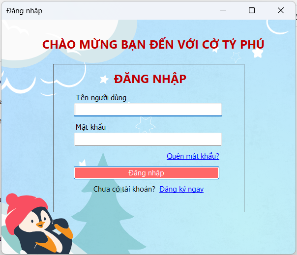 | 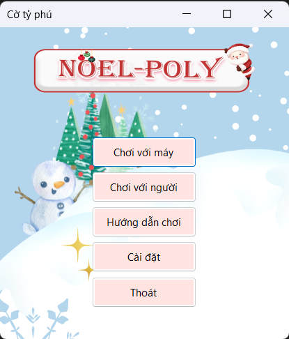 |

---

### 📝 Đăng ký & Quên mật khẩu
| Đăng ký | Quên mật khẩu |
| :---: | :---: |
| 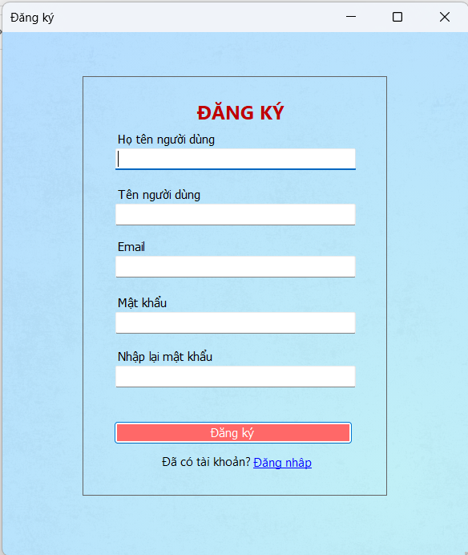 | 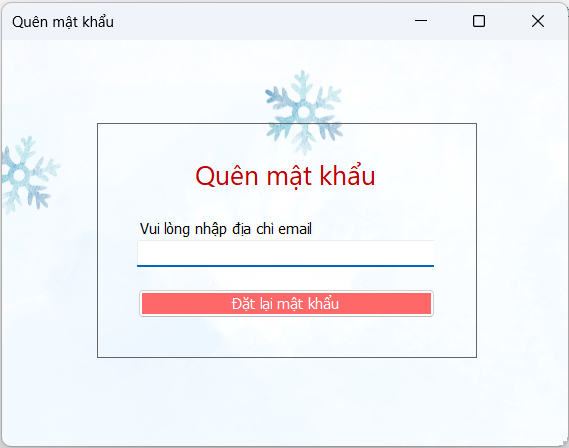 |

---

### 🔑 Xác thực OTP & Đổi mật khẩu
| Nhập OTP | Đổi mật khẩu |
| :---: | :---: |
| 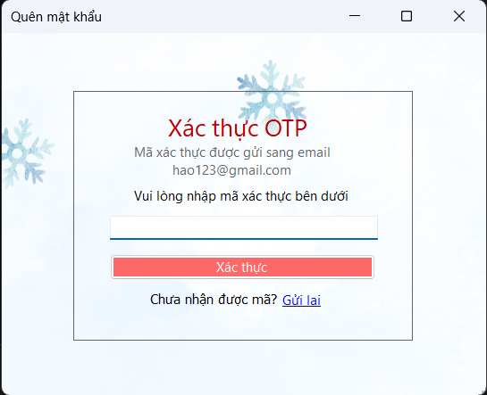 | 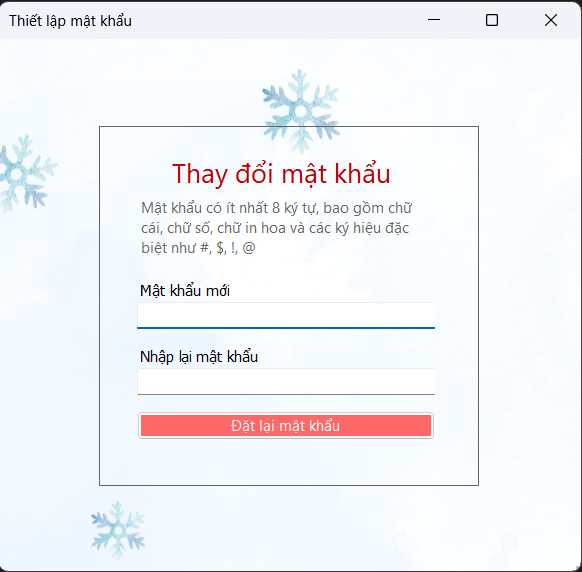 |

---

### 🎮 Chọn chế độ & Nhân vật
| Chơi với người | Chọn nhân vật |
| :---: | :---: |
| 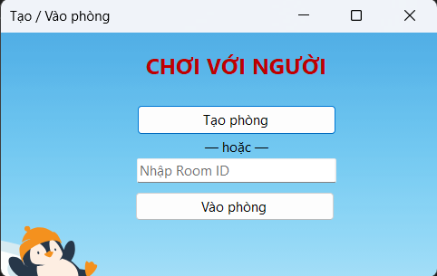 | 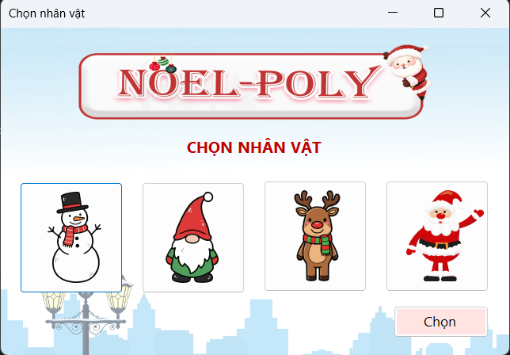 |

---

### ⏳ Phòng chờ & Lịch sử đấu
| Phòng chờ | Lịch sử trận đấu |
| :---: | :---: |
| 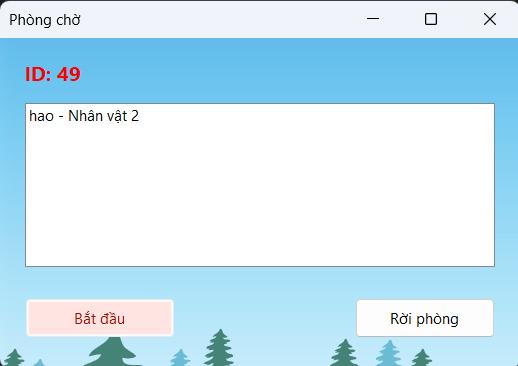 | 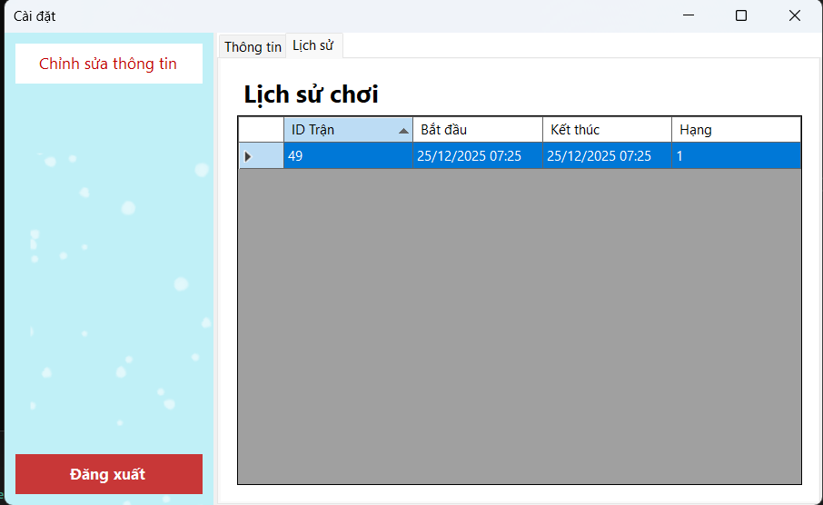 |

---

### 🏦 Bàn cờ Monopoly
| Giao diện bàn cờ |
| :---: |
| 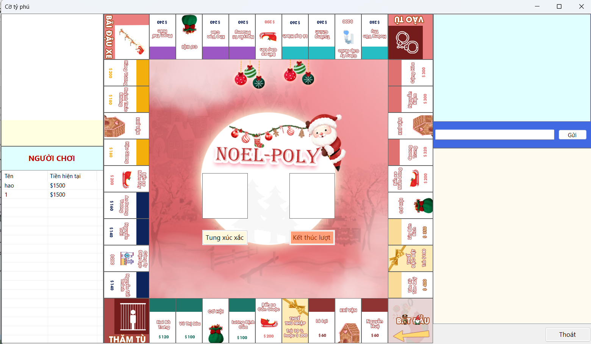 |

---

### ⚙️ Cài đặt
| Cài đặt tài khoản |
| :---: |
| 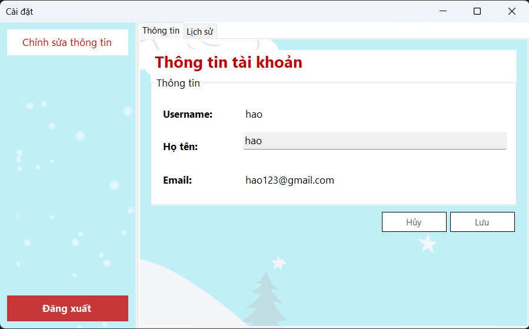 |
